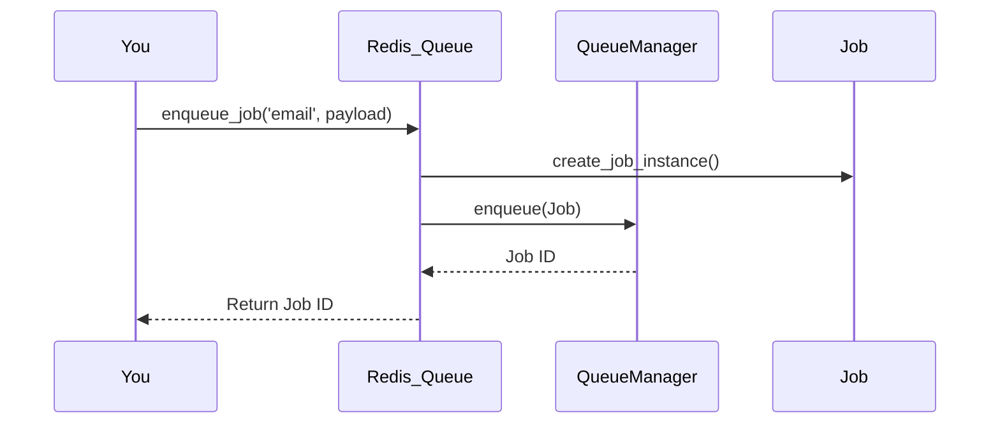

# Chapter 1: Redis_Queue (Main Plugin Singleton)

Welcome to your journey with `redis-queue`! This chapter is your first stop—here, we’ll meet the *central coordinator* of the whole plugin: the **Redis_Queue Main Plugin Singleton**.

## Why Do We Need Redis_Queue?

Imagine you want to send an email when a new user registers, resize uploaded images in the background, or sync with an external API—all **without slowing down your website** for visitors.

The solution? A *queue system* that reliably stores jobs and processes them in the background. But what manages all this complexity? That’s the job of the **Redis_Queue Singleton**!

**Analogy:**  
Think of `Redis_Queue` like the factory manager. When a new request arrives (like sending an email), it:
- Receives the job request
- Passes the job to the right queue
- Ensures workers process the job
- Provides you (the developer/admin) tools to check and control everything

## What Is a Singleton?

A **singleton** is just a special type of object that only exists once. Like the “factory manager”—there’s only *one* main coordinator for the whole queue system.

- Instead of creating many managers, you always “talk” to the same one.

## Use Case: Enqueue a Simple Job

Let’s say you want to **send a welcome email whenever a new user registers**.

With `redis-queue`, you just ask the **Redis_Queue** singleton to handle it:

```php
// Add a job: Send welcome email
$job_id = redis_queue_enqueue_job(
    'email',
    [ 'to' => 'newuser@example.com', 'subject' => 'Welcome!' ]
);

// Was it added successfully?
if ($job_id) {
    // Proceed, job is scheduled.
}
```

**Explanation:**  
You call `redis_queue_enqueue_job`, providing `'email'` as the type and details in `$payload`. The singleton takes care of all internal setup—you don’t need to initialize anything manually!

## The Role of Redis_Queue: Key Concepts

Let’s break down what Redis_Queue does for you:

1. **Initialization**  
   - Prepares everything: sets up database tables, creates essential objects, and loads settings.

2. **Global Access**  
   - Offers easy-to-use functions so you always reach the same plugin instance.

3. **Component Coordination**  
   - Sets up and “links” all main parts:  
     - Queue manager  
     - Job processor  
     - REST API ([Chapter 2](02_rest_controller__rest_api_for_the_queue_system__.md))  
     - Admin dashboard ([Chapter 3](03_admin_interface__wordpress_admin_dashboard__.md))

4. **Job Handling**  
   - Handles main actions: enqueueing jobs, updating options, providing access to all the key parts.

## How to Access and Use Redis_Queue

In most cases, you’ll use the simple helper functions. Here’s the basics:

```php
// Get the singleton instance
$plugin = redis_queue();

// Enqueue a new image processing job
$job_id = redis_queue_enqueue_job('image_processing', [ 'image_id' => 123 ]);
```

**What actually happens?**  
- The helper functions always use the **same Redis_Queue instance**.
- You can also *directly* call deeper methods if needed:

```php
// Direct access to the manager
$manager = $plugin->get_queue_manager();
```

## Sequence: How a Job Gets Enqueued

Let’s peek under the hood with a simple, real-world flow:



**Plain English Walkthrough:**
1. **You** call the helper to enqueue a job.
2. **Redis_Queue** creates a new job for the type (like “email”).
3. It passes the job to the **QueueManager**.
4. **QueueManager** stores the job and gives back a job ID.
5. **Redis_Queue** returns the job ID to you.

## Under the Hood: Minimal Code Walkthrough

Let’s look at *how* Redis_Queue ensures everything is set up only once.

**Initialization (simplified):**

```php
class Redis_Queue {
    private static $instance = null;

    public static function get_instance() {
        if (!self::$instance) {
            self::$instance = new self(); // First and only time
        }
        return self::$instance;
    }

    // ... (other setup)
}
```

**Global Helper:**
```php
function redis_queue() {
    return Soderlind\RedisQueue\Core\Redis_Queue::get_instance();
}
```
**Explanation:**  
Anytime you call `redis_queue()`, you always get the same, main plugin instance, already initialized.

**Enqueue Job Method (simplified):**
```php
public function enqueue_job($job_type, $payload, $options = []) {
    if (!$this->queue_manager) return false;

    $job = $this->create_job_instance($job_type, $payload); // Builds job object
    // ... Apply options like priority, delay, queue
    return $this->queue_manager->enqueue($job); // Actually puts job in the queue
}
```
**Explanation:**  
- Validates that the plugin is ready
- Creates a job instance based on type (`email`, `image_processing`, etc)
- Passes it to the queue manager, which stores it in Redis

**Component Setup:**

During initialization, Redis_Queue constructs key components:
- `queue_manager`: Handles Redis job storage ([Chapter 4](04_redis_queue_manager__queue___redis_connector__.md))
- `job_processor`: Executes jobs and handles errors ([Chapter 5](05_job_processor__job_executor___error_handler__.md))
- `rest_controller`: Powers REST API ([Chapter 2](02_rest_controller__rest_api_for_the_queue_system__.md))
- `admin_interface`: Dashboard UI ([Chapter 3](03_admin_interface__wordpress_admin_dashboard__.md))

*You can access any of these via the main plugin instance!*

## Analogy Recap

Still confused? Remember:

- **Redis_Queue is your one-and-only manager.**
- Whenever you want to interact with the queue (add jobs, process jobs, configure), you “knock on the manager’s office”.
- The manager (singleton) knows how to send your request to the right place.

## Summary

You now know:
- What the **Redis_Queue** singleton is, and why it matters.
- How to easily enqueue jobs and access plugin components.
- That everything routes through this central, ever-present coordinator.

Next up, discover how you can interact with your queue **over HTTP or WP-CLI** with a powerful API:

➡️ [REST_Controller (REST API for the Queue System)](02_rest_controller__rest_api_for_the_queue_system__.md)

---

Generated by [AI Codebase Knowledge Builder](https://github.com/The-Pocket/Tutorial-Codebase-Knowledge)