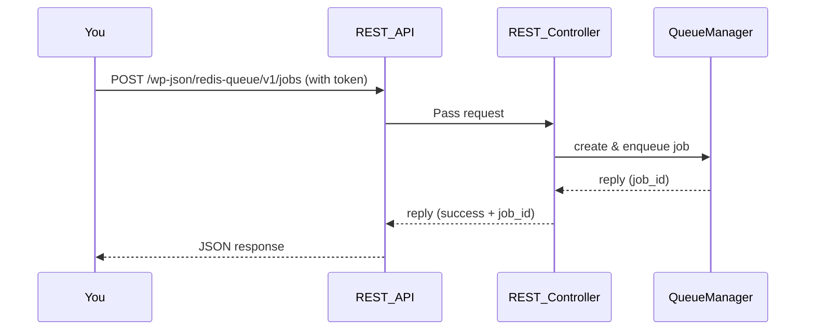

# Chapter 2: REST_Controller (REST API for the Queue System)

*Coming from [Chapter 1: Redis_Queue (Main Plugin Singleton)](01_redis_queue__main_plugin_singleton__.md)*

---

## Motivation: Why Do We Need a REST API?

Imagine you want to build a dashboard, integrate with Zapier, or trigger jobs from an external system—maybe even set up automated scripts in the cloud. How do you safely interact with your queue from *outside* WordPress or from other systems?  
This is where the **REST_Controller** comes in!

**Main Role:**  
The REST API lets you control the queue with simple HTTP requests:  
- Add, list, delete jobs  
- Trigger workers  
- Check system health  
- Monitor job status and stats  
All securely, all remotely!

**Central Use Case:**  
Suppose you want to enqueue an “Email” job whenever a new sale happens in your shop’s backend—even if it’s from an external tool or script! Using the REST API makes this simple.

---

## REST_Controller: Core Concepts (What It Does)

Let’s break down what you get:
1. **HTTP Endpoints for Everything Important**
   - Add, list, view, and delete jobs
   - Start (trigger) the worker
   - Get stats and health details

2. **Security**
   - *Who* can call the API?  
     - WordPress admins (via login & nonce) **or**
     - Secure API tokens (with different permission levels)

3. **Rate Limiting & Logging**
   - Prevent abuse (limit how often API can be called)
   - Log every API call (for auditing/troubleshooting)

---

## Example: Enqueue an Email Job via REST API

Let’s say you want to add a new job (send email) remotely.

### What You Need

- **Authentication**: WP admin login **OR** an API token (from plugin Settings)
- **Endpoint**:  
  - `POST /wp-json/redis-queue/v1/jobs`

### Minimal Example (using `curl` and token authentication):

```bash
curl -X POST \
  -H "Authorization: Bearer YOUR_TOKEN_HERE" \
  -H "Content-Type: application/json" \
  -d '{"type":"email","payload":{"to":"newuser@example.com","subject":"Hi","message":"Welcome!"}}' \
  https://YOUR_SITE.com/wp-json/redis-queue/v1/jobs
```

**What happens?**  
- If the credentials and job type are valid, you’ll get back:
  ```json
  {
    "success": true,
    "job_id": "job_abcdef123456...",
    "message": "Job created and enqueued successfully."
  }
  ```

**Explanation:**  
- The API accepts your request, creates the new job using its internal logic, and puts it in the queue!

---

## Key Endpoints: What Can You Do?

Here’s a *beginner-friendly* overview of the main API calls you’ll use:

| What You Want to Do       | HTTP Method | Endpoint                | Description                  |
|---------------------------|-------------|-------------------------|------------------------------|
| List jobs                 | GET         | `/jobs`                 | Get paged list of jobs       |
| View a job                | GET         | `/jobs/{id}`            | See details for one job      |
| Create/enqueue a job      | POST        | `/jobs`                 | Add a new job to the queue   |
| Cancel a job              | DELETE      | `/jobs/{id}`            | Cancel a not-yet-run job     |
| Trigger a worker          | POST        | `/workers/trigger`      | Process jobs immediately     |
| Get worker status         | GET         | `/workers/status`       | See last run, processing?    |
| Show stats                | GET         | `/stats`                | Get job/queue statistics     |
| Check health/status       | GET         | `/health`               | Is everything running OK?    |
| Clear a Redis queue       | POST        | `/queues/{name}/clear`  | Remove pending jobs (admins) |

**All URLs are relative to:**  
`https://YOUR_SITE.com/wp-json/redis-queue/v1/`

---

### Results and Responses: What Do You Get Back?

**Job Listing Example Response:**
```json
[
  {
    "id": "job_650fa...",
    "type": "email",
    "queue": "default",
    "status": "queued",
    "priority": 10,
    "payload": {"subject": "..."},
    "created_at": "2025-10-10 12:34:56"
  }
]
```
> Each job shows its status, queue, type, payload, etc.

---

## Security: How Access Is Controlled

To avoid random callers or hackers, the REST_Controller supports **two main authentication modes**:

1. **WordPress Admin Login + REST Nonce**  
   - Use if you’re logged into WP as admin.

2. **API Token (from plugin settings)**  
   - Use for automated scripts or integrations.

**Tokens can be limited by scope:**
- “worker” scope – only allows safe endpoints (like workers/trigger)
- “full” scope – allows all documented endpoints

> The plugin also automatically limits how many API requests your token can make per minute, and logs every request.

---

## How Does It Work Internally? Step-by-Step

Let’s visualize how the REST API handles a “Create Job” request:



**In words:**  
1. You send an HTTP POST to the jobs endpoint (with your credentials).  
2. WordPress receives the request, passes it to REST_Controller.  
3. REST_Controller checks your authentication, validates data, creates a job, and tells QueueManager to enqueue it.  
4. The job is stored, and you get a success reply with ID.

---

## Under the Hood: Internal Implementation

Let’s peek inside at how it’s built.  
The main code lives in `src/API/REST_Controller.php`.

### 1. Registering the Endpoints

```php
public function register_routes() {
    register_rest_route( self::NAMESPACE, '/jobs', [
        // GET: list jobs, POST: create job
    ]);
    // ... other endpoints
}
```
**Explanation:**  
- Sets up the main `/jobs`, `/workers/trigger`, etc., endpoints.

---

### 2. Checking Permissions

```php
public function check_permissions( $request ) {
    if ( current_user_can('manage_options') ) return true;
    // If token matches, check token scope, limits…
    // Otherwise: return error
}
```
**Explanation:**  
- Checks if caller is allowed (admin or valid token), applies scopes, rate limits, etc.

---

### 3. Creating and Enqueuing a Job

```php
public function create_job( $request ) {
    $job_type = $request->get_param('type');
    $payload  = $request->get_param('payload');
    // Create correct job object (Email_Job, etc)
    $job      = $this->create_job_instance($job_type, $payload);
    $job_id   = $this->queue_manager->enqueue($job);
    // Return success or error
}
```
**Explanation:**  
- Turns incoming request into a job object, passes to the queue, responds.

---

### 4. Rate Limiting

```php
private function enforce_rate_limit( $token, $per_minute ) {
    // Store a transient to count requests per minute for this token
    // Only allow up to “per_minute” calls
}
```
**Explanation:**  
- Ensures each token can only make limited calls each minute to prevent abuse.

---

### 5. Logging Requests (Optional)

```php
private function maybe_log_request( $response, $request ) {
    // If logging enabled, save a JSON entry to requests.log
}
```
**Explanation:**  
- Every call is logged (timestamp, status, auth type…), helping you track or audit API calls.

---

## Analogy Corner

**Think of the REST_Controller like a secure ticket counter at your factory:**
- You (or anyone with proper credentials) steps up to the counter.
- You give your request—“I need to schedule this job!” or “Please run all jobs now!”
- The attendant validates your ticket and accepts (or rejects) the request.
- Everything is logged so you have a record of what happened.

---

## Summary and Next Steps

In this chapter, you learned:
- Why the REST API is useful: enables integration and remote management.
- How to use the major endpoints: add jobs, check status, trigger workers, etc.
- How security works—API tokens, scopes, rate limits, and logging.
- What happens internally every time you use these endpoints.

The REST_Controller is your **window to the queue system from outside WordPress**.

Ready to get visual and manage jobs from the WordPress dashboard?  
Move on to [Chapter 3: Admin_Interface (WordPress Admin Dashboard)](03_admin_interface__wordpress_admin_dashboard__.md)!

---

---

Generated by [AI Codebase Knowledge Builder](https://github.com/The-Pocket/Tutorial-Codebase-Knowledge)