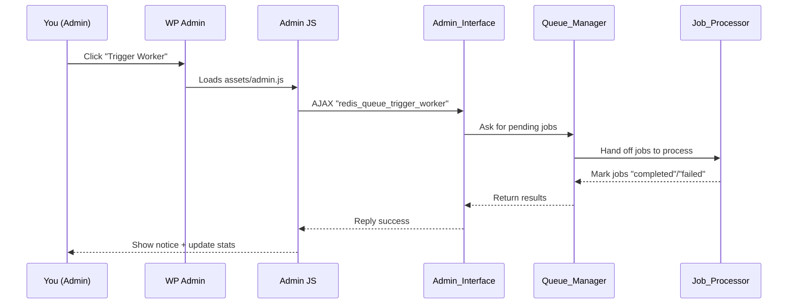

# Chapter 3: Admin_Interface (WordPress Admin Dashboard)

*Coming from [Chapter 2: REST_Controller (REST API for the Queue System)](02_rest_controller__rest_api_for_the_queue_system__.md)*

---

## Why Does `redis-queue` Need an Admin Dashboard?

Imagine you are a WordPress site admin. Suddenly, a client asks, “How many background jobs are stuck? Can you force failed emails to go out now? Is Redis even connected?”  
You don’t want to use command lines or dig into the database. You want **one simple control panel in WordPress Admin**—that’s what the **Admin_Interface** gives you!

**Main Use Case:**  
> “How can I monitor, test, and control my queues and jobs right from WordPress, *without code*?”

With the `redis-queue` **Admin Dashboard**, you can:
- See live job stats and Redis health
- Browse and manage job history
- Trigger a worker, purge jobs, or reset stuck jobs
- Submit test jobs (email, image processing, API sync)
- Configure all plugin settings—no coding needed!

Let’s explore how it works and how you (and any admin) can use it confidently.

---

## Key Concepts: What Is the Admin_Interface?

The **Admin_Interface** is the “cockpit” for `redis-queue` in the WordPress admin dashboard. Here’s how it helps:

### 1. **Menu & Pages:**
Adds menu items like:
- **Dashboard**: Overview, job stats, health status, controls
- **Jobs**: Browse, filter, view, or cancel jobs
- **Test Jobs**: Submit sample jobs to test everything safely
- **Settings**: Change Redis info, API tokens, logging, etc.

### 2. **Admin Scripts & AJAX:**
Loads special JavaScript and CSS to make everything interactive and smooth. Handles “AJAX” requests, so clicking a button gives results *instantly* (without page reload).

### 3. **Non-Developer Friendly:**
No coding, no commands—just point-and-click dashboards for everything queue-related.

### 4. **Controls & Actions:**
Buttons for:
- Triggering workers (process jobs now)
- Purging jobs (delete old, failed, or all jobs)
- Resubmitting stuck jobs
- Viewing details and results for any job

### 5. **Settings:**
Change all connection details, job limits, rate limiting, and even generate new API tokens—all securely through the UI.

---

## Getting Started: Using the Admin Dashboard

Let’s walk through solving a classic admin task:  
**“See how many jobs are queued, then trigger the worker to process them immediately—all from WP Admin.”**

### Step 1: Open the Dashboard

- Login as an admin
- In the left sidebar, find **Redis Queue**  
- Click “Dashboard”

You’ll see something like:

> **System Health:**  
> - Redis: **Connected**
> - Database: **OK**
>
> **Jobs:**  
> - Queued: 2  
> - Processing: 0  
> - Completed: 41  
> - Failed: 1

### Step 2: Trigger the Worker

- Click the **Trigger Worker** button  
   (simulated)

*What happens?*  
- The button turns “Processing…” briefly  
- The worker runs jobs in the queue  
- If jobs succeed, the counts will refresh  
- You’ll see a green notice: “Worker triggered successfully”

### Step 3: View Details (and More!)

- **Browse Jobs:**  
  Click the “Jobs” submenu to see every recent job (ID, status, type, created time).
- **View Job:**  
  Click “View” to see full details for any job—payload, result, error, status badge.
- **Purge or Reset:**  
  Use “Purge Completed,” “Purge Failed,” or “Reset Stuck Jobs” to clean up your queue.

That’s it! You’ve just managed your queue—all without any coding.

---

## A Guided Tour: Dashboard, Jobs, Test, and Settings

Let’s cover the main screens and what you can do on each.

### 1. **Dashboard**

- **See:** Job counts (“Queued,” “Processing,” “Completed,” “Failed”)
- **Monitor:** Redis and database status
- **Control:** Trigger worker, refresh stats, diagnostics, full debug test, reset stuck jobs

### 2. **Jobs**

- **Browse:** List of all jobs (filterable by status)
- **View:** Detailed modal for each job
- **Cancel:** Cancel any queued or failed job
- **Purge:** Clean up jobs with a click (by type or age)

### 3. **Test Jobs**

- **Submit test jobs easily:**  
  - Email job (to yourself or any address)
  - Image processing (provide attachment ID)
  - API sync (simulate third-party integrations)
- Instantly see if jobs are enqueued properly

### 4. **Settings**

- **Change:** Redis host/port, database, password
- **Worker controls:** Timeout, retries, delay, batch size
- **API token:** Generate/clear token for REST API usage
- **Rate limits & logging:** For secure integrations
- **Test connection:** Verify Redis works from this server

---

## How Does It Work? (Diagram & Internals)

Let’s visualize what happens when an admin clicks “Trigger Worker” on the dashboard!



**In words:**  
- *You* click a button; JavaScript sends “AJAX” to WordPress (no reload).
- `Admin_Interface` backend runs the worker by handing jobs from the `Queue_Manager` ([see [Redis_Queue_Manager](04_redis_queue_manager__queue___redis_connector__.md)]) to the `Job_Processor` ([see [Job_Processor](05_job_processor__job_executor___error_handler__.md)]).
- Results/updates are sent back and shown live on screen.

---

## A Closer Look: Minimal Internal Code

Let’s peek into how `Admin_Interface` wires up everything (code is simplified and short):

### 1. **Register Admin Pages & Scripts**

```php
public function init() {
    add_action('admin_menu', [$this, 'add_admin_menu']);
    add_action('admin_enqueue_scripts', [$this, 'enqueue_admin_scripts']);
    // ... plus AJAX handlers ...
}
```
> *Explanation*: On plugin load, it adds menu items and loads admin JS/CSS.

### 2. **Add the Dashboard Menu**

```php
public function add_admin_menu() {
    add_menu_page('Redis Queue', 'Redis Queue', 'manage_options', 'redis-queue', [$this, 'render_dashboard_page']);
    // ... submenus: Jobs, Test Jobs, Settings ...
}
```
> *Explanation*: You see “Redis Queue” in your WP menu—this is why.

### 3. **AJAX: Trigger Worker Example**

```php
public function ajax_trigger_worker() {
    check_ajax_referer('redis_queue_admin', 'nonce');
    // ...security checks...
    // Process pending jobs
    $results = redis_queue_process_jobs(['default'], 10);
    wp_send_json_success($results);
}
```
> *Explanation*: When you click “Trigger Worker,” this code runs the worker and returns results to the browser.

### 4. **Show Live Stats**

```php
public function ajax_get_stats() {
    $stats = $this->queue_manager->get_queue_stats();
    wp_send_json_success($stats);
}
```
> *Explanation*: The JavaScript on dashboard polls this and updates the stats boxes.

### 5. **Settings Save Example**

```php
private function save_settings() {
    $settings = [
        'redis_host' => sanitize_text_field($_POST['redis_host']),
        // ... other fields ...
    ];
    update_option('redis_queue_settings', $settings);
}
```
> *Explanation*: When you change Redis host/port or API token, this stores the new settings safely.

---

## Under the Hood: Where Does Everything Live?

- **PHP:**  
  - All core dashboard/action code: `src/Admin/Admin_Interface.php`
- **Templates:**  
  - Dashboard design: `src/Admin/partials/dashboard-inline.php`
  - Jobs view: `src/Admin/partials/jobs-inline.php`
  - Settings & Test: `src/Admin/partials/settings-inline.php`, `test-inline.php`
- **JavaScript & CSS:**  
  - Interactivity, modals, AJAX: `assets/admin.js` and `assets/admin.css`
- **AJAX:**  
  - e.g., `admin-ajax.php?action=redis_queue_trigger_worker` or via REST API

---

## Analogy Corner

Think of the **Admin_Interface** as your **air traffic control tower** for queue jobs:
- It gives you instruments (stats

---

Generated by [AI Codebase Knowledge Builder](https://github.com/The-Pocket/Tutorial-Codebase-Knowledge)