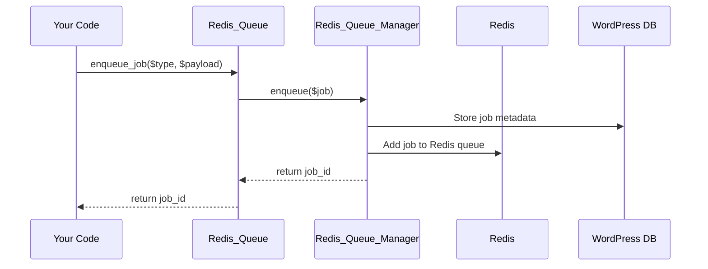

# Chapter 4: Redis_Queue_Manager (Queue & Redis Connector)

*Coming from [Chapter 3: Admin_Interface (WordPress Admin Dashboard)](03_admin_interface__wordpress_admin_dashboard__.md)*

---

## Motivation: Why Have a "Queue Manager"?

Imagine you’re running an online shop. Every time someone places an order, you want to:

- Send a confirmation email (but do it *in the background*, not slowing the checkout!)
- Process and resize product images (again, after checkout, so customers don’t wait)
- Sync order info to another system (quietly, after the order, not while the customer waits)

But how?  
Who’s actually handling these “background” jobs? **Where are they stored and managed? How do jobs get delayed or prioritized?**

That’s exactly where the **Redis_Queue_Manager** comes in!  
Think of it as your **warehouse supervisor** who:

- Connects to your "warehouse" (Redis server)
- Stores and organizes all jobs for workers to pick up later
- Handles delays, purging, migration, and stats
- Keeps a log in your WordPress database for record-keeping

Whenever something *actually happens* with a job, it’s the Redis_Queue_Manager on the job!

---

## Central Use Case: Add a Background Job (with Reliability!)

Let’s say you want to add a new job:  
“Resize image with ID 123 after it's uploaded. Run it in the background, not now.”

With the rest of your site set up, you just do:

```php
// Make the job object (see next chapters for details)
$job = new Image_Processing_Job(['image_id' => 123]);

// Get the Queue Manager and enqueue
$manager = redis_queue()->get_queue_manager();
$job_id = $manager->enqueue($job);
```
**What happens?**

- The job is stored immediately **in Redis** (fast queue for background jobs)
- The job metadata is also saved in the **WordPress database** (for browsing and safety)
- The Queue Manager takes care of everything: connection, storage, records

---

## Key Concepts: What Does Redis_Queue_Manager Do?

Let’s break it down into beginner-sized pieces:

#### 1. **Connects to Redis (the warehouse)**
- Makes a real connection to your Redis server, using the fastest available PHP library
- Handles setup, authentication, and database selection (so you don’t have to!)

#### 2. **Enqueues & Dequeues Jobs**
- **Enqueue**: Adds new job data to the queue
- **Dequeue**: Picks the oldest/highest-priority job for the next available worker

#### 3. **Handles Delayed Jobs**
- Supports *delaying* jobs (e.g., “do this job in 10 minutes”)
- Moves jobs from the delay set to the active queue at the right time

#### 4. **Synchronizes with WordPress Database**
- Every job is also logged in your WP database — so job history, recovery, and stats are possible even if Redis needs a reset

#### 5. **Cleans Up and Diagnoses Problems**
- Allows purging/stale clean-up, key prefix migration, and repair of older jobs
- Runs health checks (helpful in Admin Dashboard!)

#### 6. **Provides Queue Statistics**
- Gives you accurate "how many jobs are waiting", "how full are things", etc., live from Redis *and* the database

---

## How To Use Redis_Queue_Manager: Basic Patterns

### 1. **Enqueue a Job** (add to queue)

```php
// Get queue manager
$manager = redis_queue()->get_queue_manager();
// Enqueue a job (immediate)
$job_id = $manager->enqueue($job);
```

- **Input:** `$job` object you want to run in the background
- **Output:** Unique job ID (used for tracking), or `false` if it fails

*Want to delay the job (e.g., run in 1 hour)?*

```php
$delay_seconds = 3600;
$job_id = $manager->enqueue($job, $delay_seconds);
```

---

### 2. **Dequeue a Job** (fetch next job for processing)

Usually, you won't do this by hand — the job processor/worker ([see next chapter](05_job_processor__job_executor___error_handler__.md)) does it!  
But for illustration:

```php
// Dequeue from default queue
$job_data = $manager->dequeue();
// $job_data will be array of info about the next job (or null if empty)
```

---

### 3. **Get Queue Stats**

```php
$stats = $manager->get_queue_stats();
```
- Returns an array of queue length, delayed jobs, and database job stats

---

### 4. **Clear a Queue**

```php
$manager->clear_queue('default');
```
- Removes **all jobs** from the named queue (`'default'` in this example)

---

## What Happens Internally? (Sequence Walkthrough)

Let’s see what happens *under the hood* when you enqueue a background job.



**Step-by-step in plain English:**

1. *Your* code tells **Redis_Queue** to add a new job.
2. **Redis_Queue** passes the job to **Redis_Queue_Manager**.
3. The manager logs job info in the **WordPress database** (for safety/history).
4. Then, it adds the job to **Redis**, in the correct queue/delay set.
5. The job ID is returned all the way back to your code!

---

## Inside the Code: Beginner-Focused Deep Dive

### Where is the Redis_Queue_Manager Code?

All the main code lives in:

> `src/Core/Redis_Queue_Manager.php`

---

### 1. **Connecting to Redis**

```php
private function connect(): bool {
    // Load connection settings (host, port, password, db)
    // Try PHP Redis extension first, then Predis library
    // Set $this->connected = true on success
    // Fire 'redis_queue_connected' action
    // Return true if connected; false if error
}
```

**Beginner's Note:**  
You don’t call this directly—it runs in the background when the queue manager is created. It’s smart about fallbacks!

---

### 2. **Enqueueing a Job**

```php
public function enqueue(Queue_Job $job, $delay = null) {
    // 1. Generate unique job ID
    // 2. Store metadata in WP database
    // 3. If delay: add to "delayed" Redis zset; else add to normal queue zset
    // 4. Fire hook 'redis_queue_job_enqueued'
    // 5. Return job ID (or false if error)
}
```

**Beginner's Note:**  
All you need to do is provide a job object and (optionally) a delay—everything else is automated!

---

### 3. **Dequeuing the Next Job**

```php
public function dequeue($queues = ['default']) {
    // 1. Move ready delayed jobs into active queue
    // 2. For each queue: get the job with lowest score (highest priority)
    // 3. Remove the job from the Redis queue
    // 4. Update WP DB with status 'processing'
    // 5. Return job data (or null if empty)
}
```

**What does this accomplish?**  
- Ensures delayed jobs get “activated” on time
- Returns only the next ready job

---

### 4. **Delayed Job Processing**

```php
private function process_delayed_jobs(): int {
    // For each delayed job set: move jobs whose time has come to the active queue
    // Cleanly handle errors
}
```
**Beginner Analogy:**  
Like an alarm clock in the warehouse—“Hey, it’s time for these jobs! Move them to the worker queue!”

---

### 5. **Getting Queue Stats**

```php
public function get_queue_stats($queue_name = null): array {
    // For each queue (or all): 
    // - Ask Redis for length (zcard)
    // - Get delayed count
    // - Also look up job statuses in WordPress DB
    // Return structured array of everything
}
```
**Why both Redis and DB?**  
Redis is fast and "current", but the DB is persistent and slow-changing—tracking status for dashboard/history.

---

### 6. **Housekeeping: Purge & Diagnostics**

- **Clear a queue:**
  ```php
  public function clear_queue($queue_name) {
      // Delete the corresponding Redis key
  }
  ```
- **Diagnostics:** 
  ```php
  public function diagnostic(): array {
      // Ping Redis, test writes, list keys, etc.
  }
  ```

*These are used automatically by admin tools and for self-healing, so beginners rarely call them directly.*

---

## Common Questions Clarified

**Do I need to initialize or close Redis myself?**  
Nope! Redis_Queue_Manager does it all

---

Generated by [AI Codebase Knowledge Builder](https://github.com/The-Pocket/Tutorial-Codebase-Knowledge)