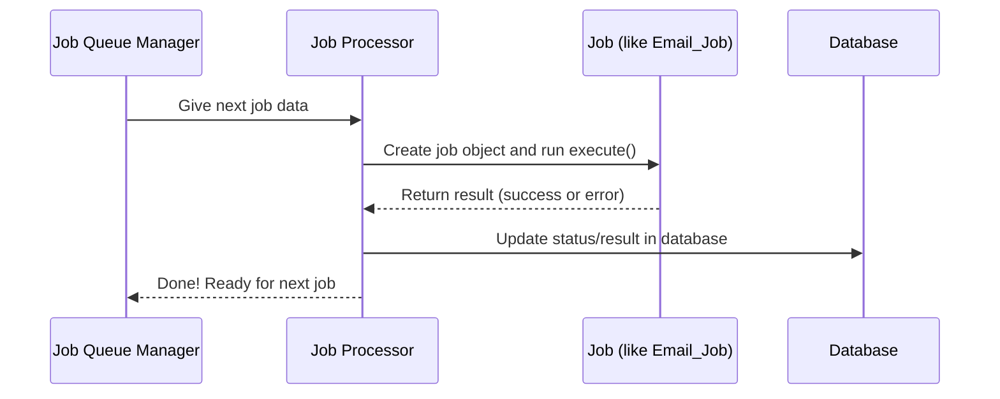

# Chapter 5: Job_Processor (Job Executor & Error Handler)

*Coming from [Chapter 4: Redis_Queue_Manager (Queue & Redis Connector)](04_redis_queue_manager__queue___redis_connector__.md)*

---

## Motivation: Why Do We Need a Job Processor?

Suppose you've added jobs to your queue—maybe "send an email," "resize an image," or "sync data with an API."  
**But who actually grabs these jobs and runs them? What happens if something goes wrong?**  
That’s where the `Job_Processor` comes in!

**Real-life use case:**  
You want every user to get a welcome email after registration. You’ve already queued email jobs by using the [Redis_Queue_Manager](04_redis_queue_manager__queue___redis_connector__.md).  
Now, you want those jobs to actually get sent—even if one fails, you want errors logged and jobs retried if possible.

**The challenge:**  
- Execute jobs safely and reliably.
- Track if they succeed or fail.
- Record results (and errors!) for admins to see.
- Prevent server problems (infinite loops, memory leaks).

**Solution:**  
The **Job_Processor** is like a *foreman* in your job “factory:”  
- Picks jobs off the queue.
- Runs them one by one.
- Watches out for errors, retries if needed.
- Records what happened.

---

## Key Concepts (What Does Job_Processor Do?)

Let’s break down the magic in beginner-friendly chunks.

### 1. **Job Execution**

- Takes the next queued job.
- Instantiates its PHP object (like "Email_Job").
- Runs its `execute()` method.

### 2. **Environment Controls**

- Sets a *timeout* for job execution (prevents infinite runs).
- Tracks how much *memory* the job used.

### 3. **Result Tracking**

- Checks if the job was successful.
- Records performance stats: execution time, memory.

### 4. **Error Handling & Retries**

- If something goes wrong, logs the error message.
- If possible, retries the job (based on job settings).
- Marks failed jobs permanently if they can’t be fixed.

### 5. **Database Updates**

- For every job, records success or failure to the database.
- Stores detailed results so you can view them in the [Admin Dashboard](03_admin_interface__wordpress_admin_dashboard__.md).

---

## Example: Processing a Job (Beginner-Friendly)

**Suppose:**  
You queued an email job for "Welcome!" to `newuser@example.com`.

### Step 1: Process the Job

Here’s the typical way (internally) to process a job:

```php
// Get a job from the queue
$job_data = $queue_manager->dequeue(['default']);

if ($job_data) {
    // Run the job using processor!
    $result = $job_processor->process_job($job_data);
}
```

**What happens next?**  
- The job object ("Email_Job") is created.
- The job’s `execute()` method is run (actually sends the email).
- Result: tracked—was it successful? Error message?
- All info saved to the database for history.

If the job fails, the processor tries to retry it if possible!

---

## Analogy: The Foreman and the Workers

Think of the **Job_Processor** like a smart *foreman* on a factory line:

- Picks up a new work order (“Send Email!”).
- Sets a stopwatch (“No more than 30 seconds for this one!”).
- Makes sure the worker doesn't use too much memory/supplies.
- Watches the result—was the job finished? Was there an accident (error)?
- If the worker dropped something, tries again (up to a safe number).
- Writes a report in the log book about how it went.

---

## How Do I Use Job_Processor?

Most of the time, you let the plugin use the processor *automatically*—when an admin triggers a worker ([Admin Dashboard](03_admin_interface__wordpress_admin_dashboard__.md)) or through WP-CLI/REST ([REST API](02_rest_controller__rest_api_for_the_queue_system__.md)).

But you can use it directly in code for testing or custom integrations:

```php
// Process up to 10 jobs from the default queue
$results = $job_processor->process_jobs(['default'], 10);

// $results contains stats and results for each job processed.
```

**Output:**  
- An array showing how many jobs were processed, total time, total memory.
- Each job has its result—success or error (for display or logging).

---

## What Happens Internally? (Beginner-Friendly Walkthrough)

Here’s a simplified diagram of what goes on when a job is processed.



**Step-by-step:**
1. The processor gets the next job from Redis (via the [Queue Manager](04_redis_queue_manager__queue___redis_connector__.md)).
2. Processor builds the job object (like “Email_Job”).
3. Processor runs the job (`execute()`).
4. Processor checks result:
    - If successful, marks as “completed.”
    - If failed, logs error, tries retry if allowed.
5. Writes everything back to the database.
6. Ready for the next job!

---

## Inside the Code: Key Methods (Simplified & Explained)

Main file:  
`src/Core/Job_Processor.php`

**1. Process a Single Job**

```php
public function process_job($job_data) {
    // Mark start time/memory
    $this->start_time = microtime(true);

    try {
        // Create and run job
        $job = $this->create_job_instance($job_data);
        $result = $job->execute();

        // Record time/memory used
        $result->set_execution_time(microtime(true) - $this->start_time);

        if ($result->is_successful()) {
            $this->handle_successful_job($job_id, $result);
        } else {
            $this->handle_failed_job($job_id, $job, $result, 1, null);
        }
        return $result;
    } catch (Exception $e) {
        // Handle failure: log error, try retry
        $result = Basic_Job_Result::failure($e->getMessage());
        $this->handle_failed_job($job_id, $job, $result, 1, $e);
        return $result;
    }
}
```

**Explanation:**  
- Records how long the job takes.
- Runs the job and gets result.
- Checks if it succeeded or failed.
- Handles retry and error reporting if it failed.
- Returns detailed result for logging/stats.

**2. Process Multiple Jobs in Batch**

```php
public function process_jobs($queues = ['default'], $max_jobs = 10) {
    $results = [];
    $processed = 0;

    while ($processed < $max_jobs) {
        $job_data = $this->queue_manager->dequeue($queues);
        if (!$job_data) break;

        $result = $this->process_job($job_data);
        $results[] = ['job_id' => $job_data['job_id'], 'result' => $result];
        $processed++;
    }
    return ['processed' => $processed, 'results' => $results];
}
```

**Explanation:**  
- Keeps pulling jobs from the queue and processes them.
- Stops when the max is reached or queue is empty.
- Returns a summary with individual results.

**3. Handle Success/Failure and Retry**

```php
private function handle_failed_job($job_id, $job, $result, $attempt, $exception = null) {
    // Check how many attempts so far
    if ($attempt < $job->max_attempts && $job->should_retry($exception, $attempt)) {
        $this->retry_job($job_id, $job, $attempt);
    } else {
        $this->mark_job_failed($job_id, $result);
    }
}
```

**Explanation:**  
- Checks if the job should be retried.
- If allowed, re-enqueues with a delay.
- If not, marks as permanently failed.

---

## Common Error Handling and Safety Features

- **Timeouts:** Ensures no job runs forever.
- **Memory Checks:** If memory gets too high, batch processing is stopped.
- **Retry Logic:** If a job fails, it’s retried a configurable number of times.
- **Database Logging:** All successes and errors are saved for easy tracking in the admin dashboard.

---

## What Happens When a Job Fails?

Let’s see a concrete example.

**Suppose:** An API sync job fails because the remote service is down.

**Job_Processor will:**
- Catch the error.
- Log the error message and code.
- Decide if it should retry (maybe after 5 minutes).
- If max retries reached, mark as failed so you’ll see it in [Admin Dashboard](03_admin_interface__wordpress_admin_dashboard__.md).

---

## Viewing Job Results and Failures

All job outcomes—success or error—are recorded in the database!  
You can easily view them with the [Admin_Interface](03_admin_interface__wordpress_admin_dashboard__.md).

---

## Summary

---

Generated by [AI Codebase Knowledge Builder](https://github.com/The-Pocket/Tutorial-Codebase-Knowledge)