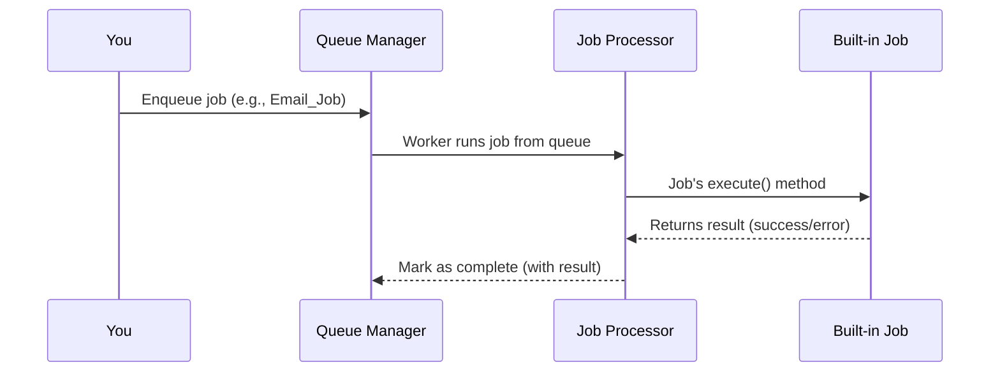

# Chapter 6: Built-in Job Types (Email_Job, Image_Processing_Job, API_Sync_Job)

*Coming from [Chapter 5: Job_Processor (Job Executor & Error Handler)](05_job_processor__job_executor___error_handler__.md)*

---

## Motivation: Why Built-in Job Types Matter

Imagine you want your WordPress site to:

- Send emails automatically when a user signs up.
- Generate image thumbnails for uploads (so your site loads fast!).
- Sync your posts with Facebook and send webhooks to another app.

You know you need background “jobs”—but **writing job code from scratch sounds scary**.  
Wouldn’t it be great if ready-made jobs existed for common needs—and all you had to do was use them?

That’s exactly what **Built-in Job Types** in `redis-queue` do for you!

### Central Use Case

**Say you want to automatically send a welcome email when someone registers:**

1. **You enqueue an Email_Job with the details.**
2. The plugin takes care of the work—no custom code, no confusion.
3. Later, want to process images or sync APIs? Just use the matching built-in job!

Let’s see how easy it is.

---

## What are Built-in Job Types? (Beginner Concepts)

The plugin ships with *three* super useful built-in jobs:

- **Email_Job**: For sending emails (single, bulk, newsletter).
- **Image_Processing_Job**: For resizing, optimizing, watermarking, or batch-generating images.
- **API_Sync_Job**: For calling external APIs, sending webhooks, pushing data to third-party services.

**Think of them like "shapes" for common problems:**  
Just fill in the blanks and let the plugin do the rest!

### Why Are They Awesome?

- **You don’t have to invent how to send emails or process images!**
- **You get best practices built-in (error handling, retries, logging, security).**
- **You can study them as examples to build your OWN job types for future needs.**

Each job...

- Is a special class (like `Email_Job`)
- Knows how to do its thing (`execute()` method)
- Supports different options (single email, newsletter... watermark, optimize... custom API...)

---

## Beginner Breakdown: Each Built-in Job

Let’s look at each job type and how it works.

### 1. **Email_Job** (Sending All Types of Email)

You can use it for...

- *Single* emails (“Welcome to our site!”)
- *Bulk* emails (“Notify these 10 people”)
- *Newsletters* (“Send this to all subscribers”)

**Just tell it: who to send, subject, message. It does the rest.**

#### Example: Send a Welcome Email

```php
// Enqueue a single email job (to one person)
$job = Email_Job::create_single_email(
    'newuser@example.com',
    'Welcome!',
    'Hi -- thanks for joining!'
);
redis_queue()->get_queue_manager()->enqueue($job);
```

> **Explanation:**  
> This schedules an email for `newuser@example.com` with your custom subject/message.  
> The job will run in the background and show up in your dashboard jobs list.

#### Example: Send a Bulk Email

```php
$bulk_emails = [
    [ 'to' => 'person1@example.com', 'subject' => 'Update', 'message' => 'Hello!' ],
    [ 'to' => 'person2@example.com', 'subject' => 'Update', 'message' => 'Hi there!' ]
];
$job = Email_Job::create_bulk_emails($bulk_emails);
redis_queue()->get_queue_manager()->enqueue($job);
```

> **Explanation:**  
> This will send different messages to each person—great for notices or event invitations!

#### Example: Send a Newsletter

```php
$job = Email_Job::create_newsletter(
    'June Newsletter',
    'Dear {name}, thanks for being a subscriber! Latest news here...'
);
redis_queue()->get_queue_manager()->enqueue($job);
```

> **Explanation:**  
> `{name}` will be auto-filled for each user! All subscribers get the email.

---

### 2. **Image_Processing_Job** (Image Magic for Your Media)

You can use it for...

- Making thumbnails and resizing images.
- Optimizing file size.
- Adding watermarks (for copyright).
- Batch-generating thumbs for lots of images.

#### Example: Generate Thumbnails for One Image

```php
$job = Image_Processing_Job::create_thumbnail_job($attachment_id);
redis_queue()->get_queue_manager()->enqueue($job);
```

> **Explanation:**  
> `$attachment_id` is the WordPress media ID. The job creates all needed thumbnail sizes, *after upload, in the background*.

#### Example: Optimize an Image

```php
$job = Image_Processing_Job::create_optimization_job($attachment_id, 85);
redis_queue()->get_queue_manager()->enqueue($job);
```

> **Explanation:**  
> Compress the image for faster loading. You can set the quality, or even change file format.

#### Example: Add a Watermark

```php
$job = Image_Processing_Job::create_watermark_job(
    $attachment_id,
    $watermark_id,
    'bottom-right' // position
);
redis_queue()->get_queue_manager()->enqueue($job);
```

> **Explanation:**  
> Protect your photos with a watermark—plugin handles merging the images!

---

### 3. **API_Sync_Job** (Connect With the World)

You can use it for...

- Pushing posts to Facebook, Twitter, LinkedIn, etc.
- Syncing contacts with your CRM (HubSpot, Salesforce, etc).
- Recording analytics data.
- Sending and receiving webhooks.
- Generic REST API calls to any service.

#### Example: Sync a Post to Social Media

```php
$platforms = [
    'facebook' => [ 'access_token' => '...' ],
    'twitter'  => [ 'access_token' => '...' ]
];
$post_data = [ 'message' => 'Check out our new post!' ];
$job = API_Sync_Job::create_social_media_job($platforms, $post_data);
redis_queue()->get_queue_manager()->enqueue($job);
```

> **Explanation:**  
> The plugin will post `post_data` to each platform, using your credentials.

#### Example: Send a Webhook

```php
$job = API_Sync_Job::create_webhook_job(
    'https://api.example.com/webhook',
    [ 'event' => 'user_signup', 'user_id' => 5 ]
);
redis_queue()->get_queue_manager()->enqueue($job);
```

> **Explanation:**  
> Instantly notifies another service about something that happened on your site.

#### Example: Sync with CRM

```php
$job = API_Sync_Job::create_crm_job(
    'hubspot',
    'create_contact',
    [ 'name' => 'Alice', 'email' => 'alice@example.com' ]
);
redis_queue()->get_queue_manager()->enqueue($job);
```

> **Explanation:**  
> Adds Alice as a contact in your CRM system!

---

## How They Work: Internal Story & Diagrams

Let’s peek *behind the scenes* at what happens when you enqueue a job.

### High-Level Flow



**Plain English:**  
- You add a job to the queue (like an email to send).
- When a worker runs, it grabs your job.
- It finds the right built-in job type (based on your code)—calls its magic `execute()` method.
- The job does all its tasks (sending, resizing, posting…).
- Worker records results (including any error) so you can see status in the dashboard!

---

## What Does the Internal Implementation Look Like?

Each built-in job is:

- A *class* extending `Abstract_Base_Job`.
- Has a main `execute()` method with lots of helpers for each use-case.
- Handles errors and success, with info for the admin dashboard.
- Includes static methods (“factory methods”) so you can easily create the right job type for your needs.

**You don’t need to worry about details—just use and study these!**

#### Example: Email_Job Skeleton (File: `src/Jobs/Email_Job.php`)

```php
class Email_Job extends Abstract_Base_Job {
    public function execute() {
        // Send single/bulk/newsletter emails
        // Handle errors and record results
    }
    // ...factory methods for job creation...
}
```

> **Explanation:**  
> `execute()` delivers emails as needed, returning job results to the processor and, eventually, the dashboard.

#### Example: Image_Processing_Job Skeleton (File: `src/Jobs/Image_Processing_Job.php`)

```php
class Image_Processing_Job extends Abstract_Base_Job {
    public function execute() {
        // Resize, optimize, or watermark an image
        // Return results or handle image errors
    }
    // ...methods for creating jobs for each operation...
}
```

> **Explanation:**  
> Handles media library alterations behind the

---

Generated by [AI Codebase Knowledge Builder](https://github.com/The-Pocket/Tutorial-Codebase-Knowledge)