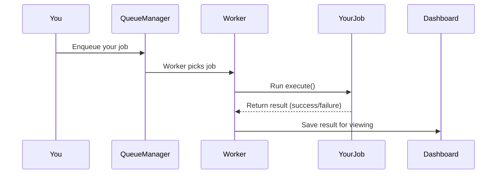

# Chapter 7: Queue_Job Interface & Abstract_Base_Job

*Coming from [Chapter 6: Built-in Job Types (Email_Job, Image_Processing_Job, API_Sync_Job)](06_built_in_job_types__email_job__image_processing_job__api_sync_job__.md)*

---

## Why Do We Need "Queue Job" Abstractions? (Motivation)

Imagine you want to run **background tasks**—for example, generating a PDF report for each user who finishes a survey. But how do you define *what* your job needs (payload), set priorities, and ensure it works like other jobs (email, images) without reinventing everything?

The answer: **Job blueprints!**

In `redis-queue`, the **Queue_Job interface** and **Abstract_Base_Job class** define the basic rules and reusable logic for EVERY job.

> **Central Use Case:**  
> "I need to create a new kind of background job (e.g., generate a custom report). How do I build it so the queue and worker know how to store, run, and retry my job—just like built-in jobs?"

**Solution:**  
By using `Abstract_Base_Job`, you get a ready-to-use foundation for everything except your job's custom 'work.'  
By following the `Queue_Job` interface, you guarantee your job fits right into the plugin: it can be enqueued, picked up, run, and retried—in code or via REST.

---

## Key Concepts (Breakdown for Beginners)

Let's walk through the two pieces:

### 1. **Queue_Job Interface:**  
The "rules all jobs must follow."

- **What it means:**  
  Imagine a universal checklist every job must complete:
  - Has a job type ("email", "report_generation", ...)
  - Has a data payload (what the job *needs* to do work)
  - Has priority, retry logic, queue name
  - Can be executed (`execute()`)
  - Knows how to handle failure and decide on retry
  - Is serializable (stored in Redis/database)

### 2. **Abstract_Base_Job:**  
A "starter job class" with all common code pre-built.

- **What it means:**  
  Imagine a cake mix—add your own flavor.  
  - Handles storing payload, priority, timeouts
  - Gives you helper methods (`success()`, `failure()`, etc.)
  - Only asks you to write `execute()`, defining _your_ job's core work
  - Makes jobs modular and easy to test, reuse, extend

---

## How Do You Use These to Create Your Own Job? (Step-by-Step Use Case)

Let's solve our example: **a custom report generation job.**

#### 1. **Create Your Job Class**  
Just subclass `Abstract_Base_Job` and fill in two pieces:
- What type of job is this?
- What does it do (the `execute()` routine)?

```php
class Report_Generation_Job extends Abstract_Base_Job {
    public function get_job_type() {
        return 'report_generation'; // Unique string for your job type
    }
    public function execute() {
        $data = ['report_id' => $this->get_payload_value('report_id')];
        // ... do the custom work here ...
        return $this->success($data); // Return result for dashboard
    }
}
```
**Explanation:**  
- This is a job named `'report_generation'`.  
- `execute()` is your "work"—it could run calculations, generate files, etc.  
- You use `get_payload_value('report_id')` to grab data you passed in.

#### 2. **Enqueue Your Job**

```php
$job = new Report_Generation_Job(['report_id' => 123]);
redis_queue()->get_queue_manager()->enqueue($job);
```
**Explanation:**  
- You make a job object, provide its "payload" (here, just a report ID), and send it to the queue!  
- The queue handles all the rest—storing, running, error tracking.

#### 3. **Process & Result**
When a worker runs, it will:
- Pick up your job
- Run `execute()`
- Save results (success or error) for you to see later

---

## What's Inside? (Beginner-Friendly Internal Walkthrough)

### Step-by-Step Sequence (How a Custom Job Is Processed)



**Plain English:**
1. You create and enqueue your job.
2. The system adds it to Redis and database.
3. When a worker (processor) runs, it creates your job object, runs `execute()`.
4. The job returns a result (success or error with details).
5. Result saved to DB, visible in the admin panel ("Jobs" list).

---

## A Glimpse: What Does the Interface Actually Require?  
Located in `src/Contracts/Queue_Job.php`.

**Checklist of What Your Job Must Have:**

```php
interface Queue_Job {
    public function get_job_type();         // Unique string
    public function get_payload();          // Data for work
    public function get_priority();         // How urgent
    public function get_retry_attempts();   // How many retries
    public function get_timeout();          // Max time to run
    public function get_queue_name();       // Which queue
    public function execute();              // Your job's work!
    public function handle_failure($e, $attempt);  // Error handler
    public function should_retry($e, $attempt);    // Whether to retry
    public function get_retry_delay($attempt);     // Pause before retry
    public function serialize();            // For saving
    public static function deserialize($data); // For restoring
}
```
**Explanation:**  
- Don't panic! `Abstract_Base_Job` already implements almost all of these. You rarely need to fill in more than just your `execute()` and type.

---

## Under the Hood: What Does Abstract_Base_Job Actually Do?  
Located in `src/Jobs/Abstract_Base_Job.php`.

```php
abstract class Abstract_Base_Job implements Queue_Job {
    // Stores payload, priority, timeout
    protected array $payload = [];
    protected int $priority = 50; // default
    protected string $queue_name = 'default';

    // All helper methods you get for free!
    public function get_payload() { return $this->payload; }
    public function set_priority($p) { $this->priority = (int)$p; }
    public function success($data = null, $meta = []) { /* ... */ }
    public function failure($msg, $code = null, $meta = []) { /* ... */ }
    // ...and much more!
}
```
**Explanation:**  
- You just inherit this, add your own flavor.  
- You use helpers to report success/failure, grab payload, etc.  
- Retry logic and error handling are built in—you can override them if needed.

---

## How to Customize: Retry Logic & Failure Handling

Suppose you want special retry rules:  
Retry only 2 times, and *never* on certain errors.

```php
public function should_retry($exception, $attempt) {
    if ($attempt >= 2) return false; // Never after 2 tries
    if ($exception instanceof InvalidArgumentException) return false; // Skip certain error
    return parent::should_retry($exception, $attempt);
}
```
**Explanation:**  
- Just override `should_retry` for *your* rules.  
- Same with failure logging or notifications.

---

## Advanced Tip: Creating Helper "Factory" Methods

For clarity, add easy helpers for job creation:

```php
public static function create_custom($id) {
    return new self(['payload_key' => $id]);
}
```
**Explanation:**  
- You can call `My_Job::create_custom(123)` to neatly package your job creation.

---

## In Practice: Why Is This So Powerful?

**Analogy:**  
Imagine every job in your queue is a worker with a badge.  
- The badge tells what kind of work it does, where it should go, how urgent it is, and how many times it can try.  
- When you hire a new kind of worker, just give them a badge and tell them how to do their job (`execute()`), and they're ready to start!

- No matter how many new job types you dream up, they all "speak" the same language to the queue—modular, reliable, easy to debug.

---

## Summary & Next Steps

In this chapter, you learned:

- How the **Queue_Job interface** sets the rules for background jobs.
- That the **Abstract_Base_Job** class is a ready-to-use base you can extend—just add your own work!
- How to create, enqueue, and manage custom jobs.
- How retry logic and error handling are built-in but customizable.

Ready to see how job *results* are tracked?  
➡️ [Job_Result Interface & Basic_Job_Result](08_job_result_interface___basic_job_result_.md)

---

---

Generated by [AI Codebase Knowledge Builder](https://github.com/The-Pocket/Tutorial-Codebase-Knowledge)