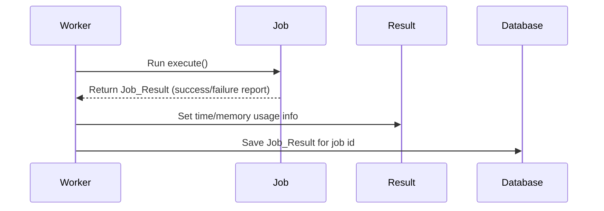

# Chapter 8: Job_Result Interface & Basic_Job_Result

*Coming from [Chapter 7: Queue_Job Interface & Abstract_Base_Job](07_queue_job_interface___abstract_base_job_.md)*

---

## Why Do We Need Job Results? (Motivation)

Imagine you're running background jobs on your site—like sending emails or generating reports.  
You want to know **if each job succeeded**, what happened if it failed, and how long it took.  
You might also want detailed info: Did an email bounce? Did image processing use too much memory?  

**Central Use Case:**  
> "I want to inspect—in my admin dashboard or via the REST API—how each job finished: Was it successful? Did it error? What's the output and execution stats?"

The `Job_Result` interface and its main implementation, `Basic_Job_Result`, are designed exactly for this need!  
They're like a **report card** for each job—standardized, easy to store, and easy to inspect!

---

## Key Concepts: Breaking Down Job Results

Let’s describe what these abstractions provide in beginner language:

### 1. **Job_Result Interface**  
Defines what a “job result” must include—think of it as the **template** for a report card:
- Was the job successful?
- Any error message or code?
- What did the job produce (data/output)?
- Execution performance: how long did it run, how much memory did it use?
- Any helpful metadata (extra info)?

**Every job must return something following this template after it runs.**

### 2. **Basic_Job_Result**  
This is the **default implementation** (a ready-made report card) for most jobs.  
- Used by built-in jobs and custom ones by default.
- It's serializable (easy to save and reload from the database).
- Lets you record all the standard info, plus custom notes if you wish.

---

## How Does It Help? (Concrete Example)

Suppose you enqueue an email job. Later, you want to see if it worked.

- The job runs in the background.
- When it's done, it creates a `Basic_Job_Result`:
    - `successful`: true or false  
    - `data`: recipient, message id, etc  
    - `error_message`: Why it failed (if it failed)
    - `execution_time`: How many seconds it took
    - `memory_usage`: Peak memory used

You can see this result in:

- The [Admin Dashboard](03_admin_interface__wordpress_admin_dashboard.md)
- The [REST API](02_rest_controller__rest_api_for_the_queue_system__.md)
- The database (for audit/history)

---

## Beginner-Friendly Analogy

**Think of Job_Result as a report card every worker fills out after their shift:**
- Did I finish? (success/fail)
- If not, what went wrong? (error message/code)
- What did I accomplish? (output data)
- How long did it take me? (time/memory)
- Any extra notes? (metadata)

**Admin and developers can then look up any "shift" (job), inspect the report, and see what actually happened!**

---

## Example: Creating and Using Basic_Job_Result

Let's see how jobs use this abstraction.  
Suppose inside a job you want to return success:

```php
use Soderlind\RedisQueue\Contracts\Basic_Job_Result;

return Basic_Job_Result::success(['email_id' => 123]);
```
**Explanation:**  
- This says: "Job succeeded, include this output data (`email_id`)."

Or, if your job needs to report an error:

```php
use Soderlind\RedisQueue\Contracts\Basic_Job_Result;

return Basic_Job_Result::failure('Email sending failed', 'smtp.001');
```
**Explanation:**  
- This says: "The job failed; here’s the reason and error code."

You **don't** need to handle time and memory—these are filled out by the queue/processor automatically!

---

### How Results Show Up (Viewing Example)

Suppose you've run jobs and you check in the admin dashboard.  
For a successful job, you might see:

```
✔️ Job Succeeded
  - Output: { "email_id": 123 }
  - Time: 0.41 seconds
  - Memory: 2.1 MB
```

For a failed job:

```
❌ Job Failed
  - Error: Email sending failed
  - Code: smtp.001
  - Time: 0.12 seconds
  - Memory: 1.8 MB
```

**You always see clear info: success or failure, error, output, and performance!**

---

## Under the Hood: Sequence of How Results Are Created and Used

Let's walk through a simple scenario—processing a job and saving the result.  



**Narrative Explanation:**  
1. The worker runs a job's `execute()` method.
2. The job returns a `Job_Result` (usually a `Basic_Job_Result`).
3. The worker fills in automatic info (execution time, memory used).
4. The result is saved to the database, visible to admins!

---

## Internal Implementation: Key Methods in Simple Terms

### The Interface (src/Contracts/Job_Result.php)

The interface says every Job_Result must provide:

```php
public function is_successful();
public function get_data();
public function get_error_message();
public function get_error_code();
public function get_metadata();
public function get_execution_time();
public function get_memory_usage();
public function to_array();
public static function from_array($data);
```
**Explanation:**  
- This is the minimum info required for a job result—error/success, output, performance stats, and serialization.

---

### The Implementation (src/Contracts/Basic_Job_Result.php)

#### Creating a Success Result:

```php
public static function success($data = null, array $metadata = []) {
    return new self(true, $data, null, null, $metadata);
}
```
**Explanation:**  
- Make a new result marked as successful, with optional output data.

#### Creating a Failure Result:

```php
public static function failure($msg, $code = null, array $metadata = []) {
    return new self(false, null, $msg, $code, $metadata);
}
```
**Explanation:**  
- Make a new result marked as failed, with error message/code.

#### Filling In Performance Info

```php
public function set_execution_time(float $time) {
    $this->execution_time = $time;
}
public function set_memory_usage(int $bytes) {
    $this->memory_usage = $bytes;
}
```
**Explanation:**  
- These are set automatically by the worker after the job finishes, so you don’t need to manage them!

#### Serializing for Storage

```php
public function to_array() {
    // assembles all info into an array
}
public static function from_array($data) {
    // makes a new result from saved info
}
```
**Explanation:**  
- Converts the result into a format for storage in the database or to send via API—and restores it as needed.

---

## Where Does This Fit in the Plugin? (How It Works with Other Parts)

- Every job ([see Queue_Job / Abstract_Base_Job](07_queue_job_interface___abstract_base_job_.md)) returns a `Job_Result` when executed.
- The processor ([Job_Processor](05_job_processor__job_executor___error_handler__.md)) records time, memory, and saves the result.
- Admin areas ([Admin_Interface](03_admin_interface__wordpress_admin_dashboard.md)) and APIs ([REST_Controller](02_rest_controller__rest_api_for_the_queue_system__.md)) fetch results to show to users.
- No matter what job type (email, image, custom), standardized results make everything consistent!

---

## Summary

In this chapter, you learned:

- The **Job_Result interface** defines the structure for job execution results—success/failure, errors, outputs, and stats.
- The **Basic_Job_Result** is the main implementation, providing easy helpers for success/failure, plus storage and performance info.
- How results are created by jobs, tracked by workers, and displayed in dashboards and APIs.
- Why this standardization makes it easy to inspect, debug, and trust your queue system.

Ready to see how jobs are run in real-time (synchronously) for testing or instant feedback?  
➡️ [Sync_Worker (Synchronous Worker)](09_sync_worker__synchronous_worker__.md)

---

---

Generated by [AI Codebase Knowledge Builder](https://github.com/The-Pocket/Tutorial-Codebase-Knowledge)