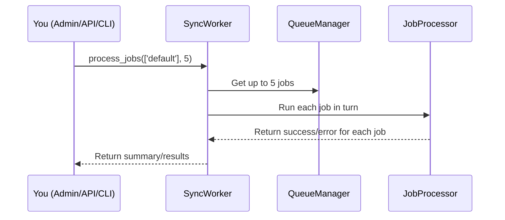

# Chapter 9: Sync_Worker (Synchronous Worker)

*Coming from [Chapter 8: Job_Result Interface & Basic_Job_Result](08_job_result_interface___basic_job_result_.md)*

---

## Why Do We Need a Synchronous Worker? (Motivation)

Imagine you’re an admin, and you see a list of jobs waiting in your site’s background queue. You want to **process those jobs right now**—maybe to test, debug, or just get things moving!  
Or maybe you’re running a script from WP-CLI or a REST API call that should process all jobs *immediately* and wait for the results.

**Central use case:**  
> *“I want to instantly process queued jobs (without waiting for scheduled background workers), see what happened, and get detailed stats—right from the dashboard, the REST API, or CLI.”*

That’s exactly what the **Sync_Worker (Synchronous Worker)** is for!

---

## What Does Sync_Worker Do? (High-Level Overview)

Think of Sync_Worker as an **actual factory worker** who works on jobs as soon as you tell them—**right now**, while you wait, and never in the background.  
They:

- Grab jobs from the queue instantly
- Pass them to the (see: [Job_Processor (Job Executor & Error Handler)](05_job_processor__job_executor___error_handler__.md)) to actually do the work
- Track statistics (how many succeeded/failed, how long it took)
- Let you, as admin or API, trigger “run all jobs now”
- Useful for both manual testing and scheduled “run now” operations (cron, CLI, or admin dash)

**Analogy:**  
If your main “workers” are on autopilot in the factory (running in the background), Sync_Worker is the manager you call into the office and say, “Process these jobs NOW while I watch!”

---

## Key Concepts Explained

Let’s break down the main concepts behind Sync_Worker one by one, in friendly beginner language:

### 1. **Synchronous Processing**
- Jobs are handled **immediately**, as soon as you call Sync_Worker.
- No “wait for the next cron” or background runner—you see results right away.

### 2. **Job Pickup and Execution**
- Sync_Worker asks the [Redis_Queue_Manager (Queue & Redis Connector)](04_redis_queue_manager__queue___redis_connector__.md) for jobs.
- Then hands each job to the [Job_Processor (Job Executor & Error Handler)](05_job_processor__job_executor___error_handler__.md) to run and track results.

### 3. **Statistics and Reporting**
- Keeps track of how many jobs it processed
- Shows how many failed, the total execution time, and the worker's uptime
- Lets you get these stats programmatically (for dashboards, REST responses, debug logs)

### 4. **Manual and Programmatic Control**
- You (the admin or a plugin) can trigger Sync_Worker from:
  - WordPress Admin dashboard
  - REST API endpoint
  - WP-CLI command
  - Custom code  
- You get instant feedback—great for testing new jobs, running experiments, or clearing the queue NOW.

### 5. **Safety Features**
- Respects CPU/memory/time limits
- Handles errors gracefully
- Lets you reset stats, change config (like max jobs per run), and ask if it should keep working

---

## How Do You Use Sync_Worker? (Step by Step)

Let’s walk through a simple admin use case:

**Use Case**:  
*Suppose you want to process up to 5 background jobs immediately from code (or Ajax in the dashboard), and get a summary of what happened.*

### 1. Create an Instance (Usually Handled for You)

If you want to do it manually (for testing):

```php
$worker = new Sync_Worker($queue_manager, $job_processor);
```
*Explanation: Pass in your main queue manager and job processor objects. In most plugins and admin calls, this is done for you.*

### 2. Process Jobs Now!

```php
$results = $worker->process_jobs(['default'], 5);
```
*Explanation: This tells the worker to process up to 5 jobs from the "default" queue, right now.*

### 3. Inspect the Results

The `$results` array looks like this:

```php
[
  'success'      => true,
  'processed'    => 5,
  'total_time'   => 3.12,
  'total_memory' => 2048000,
  'results'      => [/* array of job results */],
  'worker_stats' => [/* worker summary info */],
]
```
*Explanation: You see how many jobs were processed, how long it took, how much memory was used, and detailed output for each job (success or error).*

#### Where Is This Used?
- Click “Trigger Worker” in the [Admin Dashboard](03_admin_interface__wordpress_admin_dashboard__.md)  
  ➔ This calls Sync_Worker right away!
- Hit `/workers/trigger` in the [REST API](02_rest_controller__rest_api_for_the_queue_system__.md)  
- Run `wp redis-queue process` in the command line

---

### More Examples: Minimal Calls

#### Process Just One Specific Job by Its ID

```php
$worker->process_job_by_id($job_id);
```
*Explanation: This picks one job (for example, a failed one you want to retry) and runs it immediately.*

#### Get Worker Status

```php
$worker->get_status();
```
*Explanation: Returns the current state (idle/working/error), how long the worker has been alive, connected stats, etc.*

---

## What Happens Internally? (Step-by-Step Dummy Example)

Let’s visualize what goes on when you call `process_jobs`.



**Plain English:**
1. You call Sync_Worker to process jobs.
2. It gets jobs from the queue manager.
3. It asks job processor to execute each job while you wait.
4. Collects all results (success/error/metrics).
5. Gives you a summary.

---

## A Beginner Walkthrough: Minimal Internal Code

All the main code is in  
`src/Workers/Sync_Worker.php`.

### **1. Start the Worker (Constructor)**

```php
public function __construct($queue_manager, $job_processor, $config = []) {
    $this->queue_manager = $queue_manager;
    $this->job_processor = $job_processor;
    // ...set up statistics and config...
}
```
*Explanation: Sets up a new worker, ready to process jobs immediately.*

---

### **2. Process Jobs Now**

```php
public function process_jobs($queues = ['default'], $max_jobs = null) {
    if (!$this->queue_manager->is_connected()) {
        return ['success' => false, 'error' => 'Redis connection not available'];
    }
    $this->state = 'working';
    // ...get jobs and process them...
    $results = $this->job_processor->process_jobs($queues, $max_jobs ?? 10);
    // ...track stats...
    $this->state = 'idle';
    return [
        'success' => true,
        'processed' => $results['processed'],
        'results' => $results['results'],
        'worker_stats' => $this->get_stats(),
    ];
}
```
*Explanation:*  
1. Checks if Redis is connected.
2. Updates its own state to "working."
3. Asks the job processor to handle jobs (re-using all retry/error handling).
4. Updates stats, sets the state back to "idle."
5. Returns a detailed summary.

---

### **3. Process a Specific Job Immediately**

```php
public function process_job_by_id($job_id) {
    // Find job in database by ID
    // Ask job_processor to run it
    // Update stats, return result
}
```

*Explanation: Lets you run a job by its unique ID, great for retries from admin or API.*

---

### **4. Stats and Health**

```php
public function get_stats() {
    return [
        'jobs_processed' => $this->stats['jobs_processed'],
        'jobs_failed' => $this->stats['jobs_failed'],
        // ...uptime, success rate, etc...
    ];
}
public function get_status() {
    return [
        'state' => $this->state,
        'uptime' => microtime(true) - $this->stats['start_time'],
        // ...memory use, config, etc...
    ];
}
```
*Explanation:  
- Lets you check if the worker is running.
- Shows jobs processed, failures, uptime, and other limits (useful for monitoring in the dashboard/API).*

---

### **5. Safety: Should the Worker Stop?**

```php
public function should_stop() {
    // If memory nearly out or time runs out, return true to stop
}
```
*Explanation:  
Prevents runaway jobs or memory overuse.  
If the worker hits safety limits, it will stop processing and return immediately.*

---

## Analogy Corner

**Think of Sync_Worker as your on-demand,

---

Generated by [AI Codebase Knowledge Builder](https://github.com/The-Pocket/Tutorial-Codebase-Knowledge)