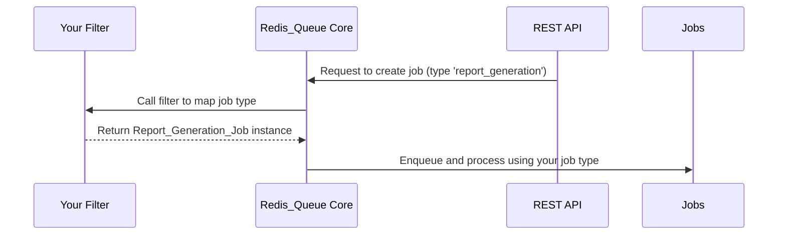

# Chapter 10: Filters & Extensibility Hooks

*Coming from [Chapter 9: Sync_Worker (Synchronous Worker)](09_sync_worker__synchronous_worker__.md)*

---

## Why Filters & Extensibility Matter (Motivation)

You now know how to enqueue jobs, run workers, handle results, and process jobs live. But what if you want to **customize the queue for your unique WordPress site**—add new job types, control retries, tweak API permissions, or change what admins see?

**Central Use Case:**  
> “Suppose you need a new job called `report_generation`, or want to only allow worker tokens to run jobs during office hours, without touching any core plugin code. How do you do this *safely and easily*?”

The answer is **Filters & Extensibility Hooks**!

In WordPress, **filters** are magic levers you use to adjust how things work—without ever hacking the main plugin.  
They make the system “pluggable,” so you can customize any part to fit your site!

---

## Key Concepts (Breaking Down Filters & Hooks)

Let’s unpack each idea in beginner language.

### 1. **What Are Filters?**

- Filters are like *customizable knobs or switches* in the code.
- You “hook” your own code to them from your theme or another plugin.
- The plugin checks each filter before making a decision, giving you a chance to change it.
- Analogy: Like a factory with levers—admins or developers pull different levers to change how things work.

### 2. **What Can I Customize?**

You can use filters to:
- Add custom job types (for your business logic)
- Change how jobs retry/backoff after errors
- Validate or reject job payloads before enqueuing
- Hide admin UI pages you don’t need
- Tune API permissions/rate limits *just for your site*
- Control which queues or endpoints a REST token can access

You do all this safely in your own code.  
**No core plugin changes required!**

### 3. **How Do Filters Work?**

- The plugin says: "Hey, before I decide, let’s ask the filter what to do..."
- You add a simple function (using `add_filter`) to change the outcome.
- Analogy: The plugin is a chef, and filters are the optional ingredients you hand to them.  
  Want more flavor? Add your ingredient—the chef mixes it in!

---

## Using Filters: Solving a Real Use Case

**Scenario:**  
Let’s say you want to add a new job called `report_generation` for producing PDFs, **and** you want to limit token-based API triggers to office hours.

### 1. Adding a Custom Job Type

Use the `redis_queue_create_job` filter.  
Add this code in your theme’s `functions.php` or your custom plugin:

```php
add_filter( 'redis_queue_create_job', function( $job, $type, $payload ) {
    if ( 'report_generation' === $type ) {
        return new Report_Generation_Job( $payload );
    }
    return $job;
}, 10, 3 );
```
**Explanation:**  
- When the plugin tries to create a job, it calls your filter.
- If the type is `report_generation`, it returns your custom job.
- Otherwise, nothing is changed.

### 2. Controlling API Token Hours

Use the `redis_queue_token_scope_allow` filter:

```php
add_filter( 'redis_queue_token_scope_allow', function( $allowed, $scope, $request ) {
    // Only allow triggers between 6am–10pm UTC
    $hour = (int) gmdate('G');
    if ( 'worker' === $scope && ( $hour < 6 || $hour > 22 ) ) {
        return false;
    }
    return $allowed;
}, 10, 3 );
```
**Explanation:**  
- For worker-scope tokens, only allow triggers during office hours (UTC).
- For all other cases, let the plugin use its normal logic.

### 3. Hiding The “Test Jobs” Admin Page

If you want to hide the test jobs page for security:

```php
add_filter( 'redis_queue_show_test_jobs_page', '__return_false' );
```
**Explanation:**  
- The UI no longer shows or allows access to the “Test Jobs” area.

---

## Example Inputs & Outputs

**Input:** You enqueue a job of type `report_generation` via the REST API or backend.

**Filter action:** Your filter creates a `Report_Generation_Job` instance, so the plugin knows exactly how to execute it.

**Output:** The job is processed like any built-in type, showing up normally in the dashboard and API.

**Input:** An API token tries to trigger the queue at 3am UTC.

**Filter action:** Your filter says “not allowed,” so the API returns a 403 error for this request.

**Output:** Security is respected—only allowed during the set hours. No core code changed!

---

## What Happens Internally? (Step-by-Step Sequence)

Let’s walk through what happens under the hood when you use a filter.


**Plain English Story:**  
1. The plugin receives a job creation request.
2. Before accepting, it calls your filter for custom job types.
3. Your code responds with a custom job instance if needed.
4. The plugin continues as usual—no code hacked, just used your “ingredient.”

---

## Under The Hood: Filter Implementation & Simple Code

Each filter is just a call to WordPress’s `apply_filters()` function. For example:

```php
// In plugin/internal file:
$job = apply_filters( 'redis_queue_create_job', null, $job_type, $payload );
```
**Explanation:**  
- The plugin offers a “chance” for your code to make a decision before it does something important.
- If you provide a response, it uses that!

All you need is:

```php
add_filter( 'filter_name', function( $params... ) {
    // Your decision logic...
    return new_object_or_value;
});
```
**Explanation:**  
- You provide your own logic (what, when, how).
- WordPress handles all linking—safe, updatable, modular.

Refer to the [Filters Reference](filters.md) for a complete list of available filters.

---

## Visual Guide: Common Filters & What They Do

| **Filter Name**                       | **What You Change**                      | **Example Use Case**                       |
|----------------------------------------|------------------------------------------|--------------------------------------------|
| `redis_queue_create_job`               | Custom job mapping                       | Add new business logic jobs                |
| `redis_queue_job_classes`              | Job type to PHP class map                | Override/extend job processing             |
| `redis_queue_should_retry_job`         | Retry policy for failed jobs             | Skip retries for certain exceptions        |
| `redis_queue_job_retry_delay`          | Wait time between retries                | Add jitter/randomness to backoff           |
| `redis_queue_show_test_jobs_page`      | Admin UI visibility                      | Hide test pages in production              |
| `redis_queue_validate_job_payload`     | Accept/reject job payloads               | Block jobs with missing/invalid data       |
| `redis_queue_token_allowed_routes`     | API routes accessible by tokens          | Limit tokens to trigger-only endpoints     |
| `redis_queue_token_scope_allow`        | Per-request API permissions              | Block API calls during weekends/hours      |

*See [Filters Reference](filters.md) for all details.*

---

## Analogy Time!

**Think of filters like giving the factory manager extra rules:**
- "Only run this machine during the day!"
- "Add new job types I invented!"
- "Retry this job twice, but skip if network fails!"
- "Hide certain buttons from junior staff!"

**You add your rules. The factory runs as usual, but follows YOUR preferences!**

---

## Conclusion & Next Steps

You’ve just learned:

- What *filters & hooks* are, and why they’re crucial for adapting `redis-queue` to your needs.
- How to add new job types, change admin UI, and fine-tune security—all **without touching core plugin code!**
- The main filter points available, and how to use them for real site requirements.

Ready to build your own jobs and integrations? Dive into  
➡️ [Extending Jobs](extending-jobs.md)

---

**You’re now prepared to shape `redis-queue` for any project—no limits, just possibilities!** 🚀

---

Generated by [AI Codebase Knowledge Builder](https://github.com/The-Pocket/Tutorial-Codebase-Knowledge)