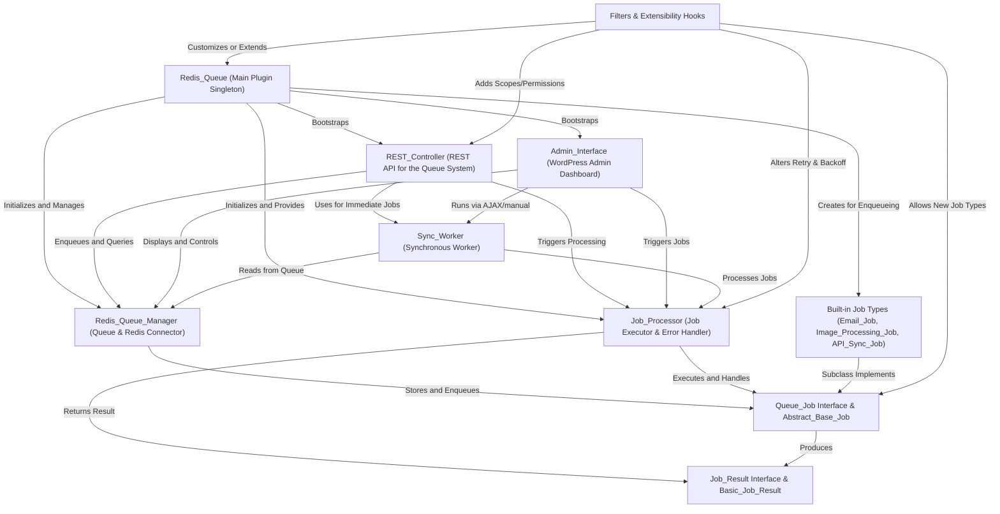

# Tutorial: redis-queue

**Redis Queue** is a WordPress plugin that enables *powerful, reliable background job processing* using **Redis** as a fast backend. With it, you can schedule, delay, or retry background tasks (like sending emails, processing images, or syncing with APIs), all managed through a *user-friendly* admin dashboard, a secure REST API, and pluggable job types. It is ideal for offloading heavy or slow WordPress work so your site stays fast and responsive.

**Source Repository:** [https://github.com/soderlind/redis-queue](https://github.com/soderlind/redis-queue)

## Chapters

1. [Redis_Queue (Main Plugin Singleton)
](01_redis_queue__main_plugin_singleton__.md)
2. [REST_Controller (REST API for the Queue System)
](02_rest_controller__rest_api_for_the_queue_system__.md)
3. [Admin_Interface (WordPress Admin Dashboard)
](03_admin_interface__wordpress_admin_dashboard__.md)
4. [Redis_Queue_Manager (Queue & Redis Connector)
](04_redis_queue_manager__queue___redis_connector__.md)
5. [Job_Processor (Job Executor & Error Handler)
](05_job_processor__job_executor___error_handler__.md)
6. [Built-in Job Types (Email_Job, Image_Processing_Job, API_Sync_Job)
](06_built_in_job_types__email_job__image_processing_job__api_sync_job__.md)
7. [Queue_Job Interface & Abstract_Base_Job
](07_queue_job_interface___abstract_base_job_.md)
8. [Job_Result Interface & Basic_Job_Result
](08_job_result_interface___basic_job_result_.md)
9. [Sync_Worker (Synchronous Worker)
](09_sync_worker__synchronous_worker__.md)
10. [Filters & Extensibility Hooks
](10_filters___extensibility_hooks_.md)

---

Generated by [AI Codebase Knowledge Builder](https://github.com/The-Pocket/Tutorial-Codebase-Knowledge)